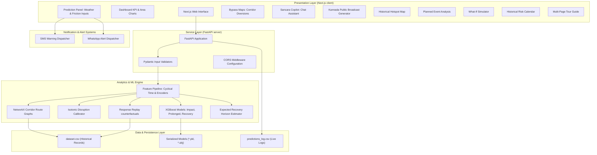
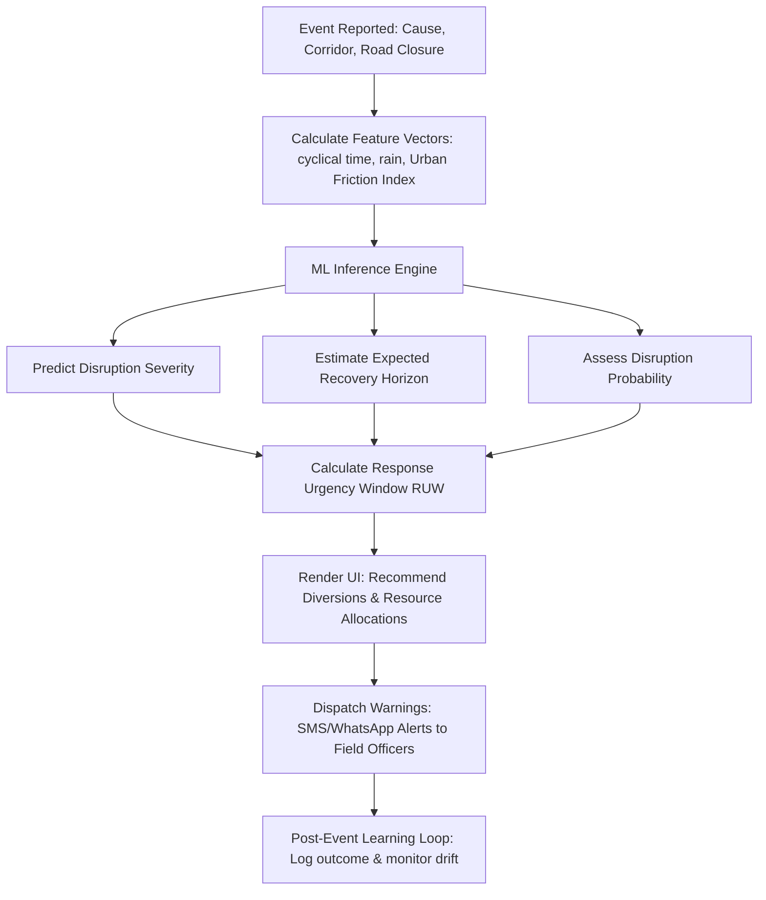

<p align="center">
  
</p>

---

## Sañcāra

**Sañcāra** is an AI-powered urban mobility operations platform designed for traffic management centers. Using network analytics, corridor intelligence, and resource planning models trained on **8,173 historical Bengaluru traffic events**, it helps operators anticipate disruption, plan diversion routes, and optimize field deployments to restore mobility faster.


---

## System Architecture

Sañcāra uses a decoupled client-server architecture. The Next.js client interacts with the FastAPI backend via REST API endpoints.



### Directory Structure
```
api.py                     FastAPI backend endpoints
train.py                   Model training & serialization pipeline
src/
  feature_engineering.py   Friction indices, cyclical temporal & network centrality features
  models.py                Model loading wrappers & prediction pipelines
  network.py               Junction routing, corridor graphs, & propagation
  ttf.py                   Expected Recovery Horizon & Response Urgency Window (RUW)
  cascade_autopsy.py       Response Replay counterfactual engine
  black_box.py             Incident reconstruction & delay accounting
  early_warning.py         Pre-event risk indexing
  post_event.py            Prediction drift & calibration logs
  explain.py               SHAP local explainability waterfalls
  vulnerability.py         Junction fragility scoring
  similarity.py            TF-IDF event similarity matching
  hotspot_detection.py     DBSCAN spatial event clustering
  resources.py             Context-aware resource recommendation mappings
frontend/                  Next.js Web Application
  src/app/
    broadcast/             ಕನ್ನಡ (Kannada) Public Broadcast Generator
    heatmap/               Historical Hotspot Map (Leaflet raw coordinates)
    planned/               Planned Event Analysis (breakdowns & peak times)
    simulator/             What-If Scenario Simulator (side-by-side ML predictions)
    calendar/              Historical Risk Calendar (with Monthly Summary sidebar)
  src/components/
    TourGuide.tsx          Interactive Multi-Page Tour Guide component
    Sidebar.tsx            Responsive sidebar navigation component
```

---

## Operational Data Flowchart



---

## Key Features

Sañcāra includes thirteen core features and diagnostic modules designed to support traffic operations:

1. **Dashboard Metrics**: Provides a high-level overview of traffic event trends, spatial distributions, and active incident diagnostics.
2. **Event Impact Prediction**: Predicts congestion severity, estimated resolution time, and resource needs using the XGBoost ML model backend.
3. **Historical Hotspot Map**: Displays raw historical traffic event coordinates in Bangalore on an interactive Leaflet map with location click popups.
4. **Junction Vulnerability Index**: Ranks and highlights critical junctions based on historical incident counts, average delays, and road closures.
5. **Historical Case Search**: Matches and finds similar past traffic incidents in the ASTRAM dataset using Cosine Similarity.
6. **Response Replay & Autopsy**: Performs autopsy analysis on past events to determine counterfactual point-of-no-return and response efficacy.
7. **Corridor Analysis**: Visualizes major Bengaluru corridors, active congestion levels, and junction nodes.
8. **Planned Event Analysis**: Details construction, VIP movements, protests, and processions from the ASTRAM dataset to assess temporal/spatial risk.
9. **What-If Scenario Simulator**: Compares two event configurations side-by-side to evaluate cascading congestion and cascaded delay risks.
10. **Historical Risk Calendar**: Displays a daily heatmap grid of incidents with a vertical monthly summary sidebar showing key averages.
11. **Kannada Public Broadcast Generator**: Generates public traffic advisory announcements in Kannada with English reference translations.
12. **AI Chatbot**: Answers traffic queries and suggests routing and deployment strategies using an LLM chatbot.
13. **Resource Allocator**: Recommends resource allocations (officers, barricades, diversions) based on event priority and road closures.

*Additionally, a global **Interactive Tour Guide** can be activated via a floating blue oval button to guide users through each of these features, alongside a **Dark Mode Toggle** next to the logo to switch application themes.*

---

## ML Pipeline

Sañcāra features clean temporal splitting (Train: Nov 2023 – Mar 2024; Held-out Test: Mar – Apr 2024).

- **Expected Recovery Horizon:** Uses Accelerated Failure Time (AFT) survival regression (`survival:aft`) to model true clearance times while accounting for right-censored active events.
- **Calibrated Disruption Probability:** Employs Isotonic Calibration to reduce the Brier score to `0.038`, matching predicted risks to actual frequencies.
- **Explainability:** Surfaced via local tree-SHAP value contributions directly inside the dashboard.

| Model | Task | Technique | Result |
|---|---|---|---|
| **Disruption Classifier** | Will it cause high disruption? | XGBoost + Isotonic Calibration | ROC-AUC 0.91, PR-AUC 0.64, Brier 0.038 |
| **Impact Classifier** | Severity (Low → Critical) | XGBoost, composite-severity label | 71.3% Accuracy, macro-F1 0.62 |
| **Recovery Horizon (AFT)** | Expected clearance time | XGBoost `survival:aft` | MedAE 60 min on reliable events |
| **Prolonged Disruption** | Disruption > 60 min | XGBoost binary classification | in-dist AUC ~0.61 |

---

## Tech Stack

- **Frontend:** Next.js 14, React 18, Tailwind CSS, Recharts, Leaflet Maps (supports MapmyIndia / Mappls raster tile layers).
- **Backend API:** FastAPI, Uvicorn, Pydantic.
- **Analytics & ML:** XGBoost, Scikit-Learn, Pandas, NumPy, NetworkX.

---

## Local Development Setup

### Backend & Model Training
Ensure Python 3.10+ is installed.

```bash
pip install -r requirements.txt
python train.py
python api.py
```
*Backend runs at `http://localhost:8000`.*

### Frontend Dashboard
Ensure Node.js (v18+) is installed.

```bash
cd frontend
npm install
npm run dev
```
*Web dashboard runs at `http://localhost:3002`.*

---

## Known Limitations

- **Administrative Resolution Censoring:** A substantial portion of historical resolution records are censored due to administrative delay. We handle this through survival bounds (AFT).
- **Composite Disruption Metric:** Ground-truth severity labels are absent in ~70% of historical events. Sañcāra resolves this by calculating a composite severity index during training.
- **Graph Simplification:** The road network graph uses coordinates and Shared Corridor Edges (kNN approximations) instead of a direct OSM import.

---

## Future Scope

- **Advanced Survival Estimators:** Transitioning from parametric AFT to Kaplan-Meier or Cox Proportional Hazards curves categorized by incident causes.
- **OSMnx Graph Integration:** Importing full OpenStreetMap road meshes to enable accurate edge-weight routing.
- **LLM Dispatcher Assistant (Sancara Copilot):** Grounding Sancara Copilot on live model predictions via Retrieval-Augmented Generation (RAG).
- **MapmyIndia SDK Integration:** Native vector mapping and real-time traffic layers integration via MapmyIndia (Mappls) Web JS SDK v3.0.
- **Urban Friction Index Expansion:** Integrating enforcement and illegal parking intelligence (Theme 1) directly into the prediction loops.
- **Reinforcement Learning Routing:** Optimizing detour configurations dynamically.

---

## Team Members

- **Harsh Sahu**
- **Yash Chawla**
- **Barsha Mondal**
- **Arpan Kark**